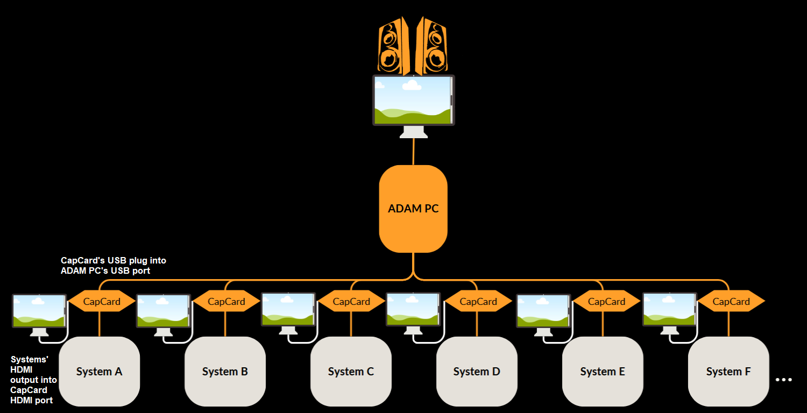

# About ADAM (in early development phase)
Auxillary Dynamic Alert Monitor (ADAM) is a user-customisable alert monitoring system that takes in display inputs from connected systems, analyses their screen content, and alerts the user if configured word triggers are detected. ADAM is designed to function completely offline and to not interact with/control the connected systems in any way (all it does is "see"). ADAM is useful in environments where Internet connectivity is not available, and where the systems to be monitored are not able to connect to typical monitoring systems and devices.

## Problem Statement

## Introduction
We utilise a series of hardware components to help pipe all the screens that we are monitoring into one desktop, where a series of software 
will process these screens and based on the keywords provided by the user, an alert will pop up. This helps to reduce the strain on the monitoring crew which is required to constantly look at the whole set of screens.

## Overview
The overall set up is as shown in the image below.

### Hardware Component
In this project, our main hardware components consist of the USB-HDMI Capture Card and a desktop, which we term as the Central Computer.
